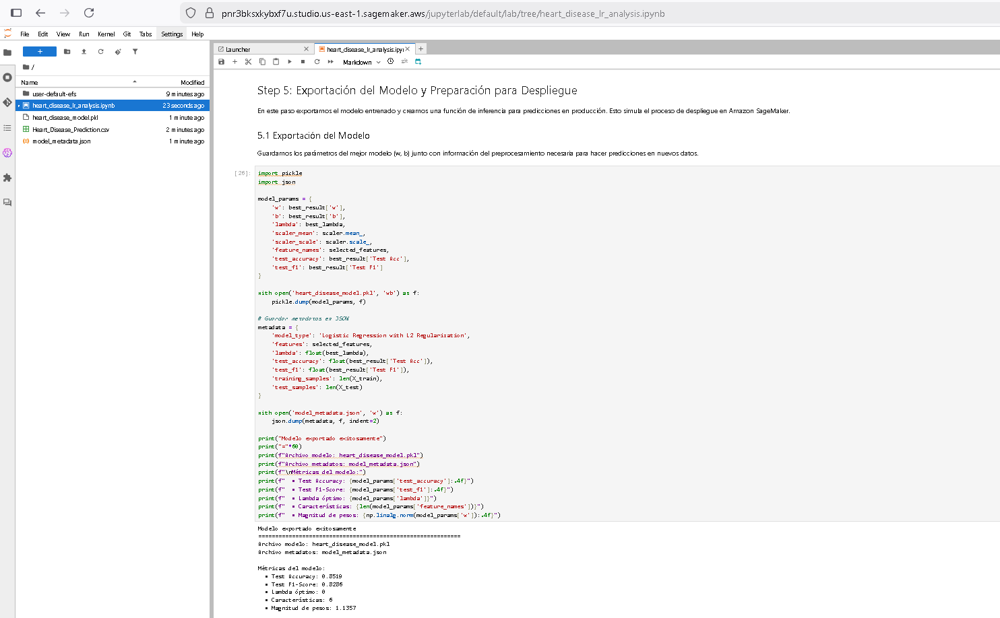
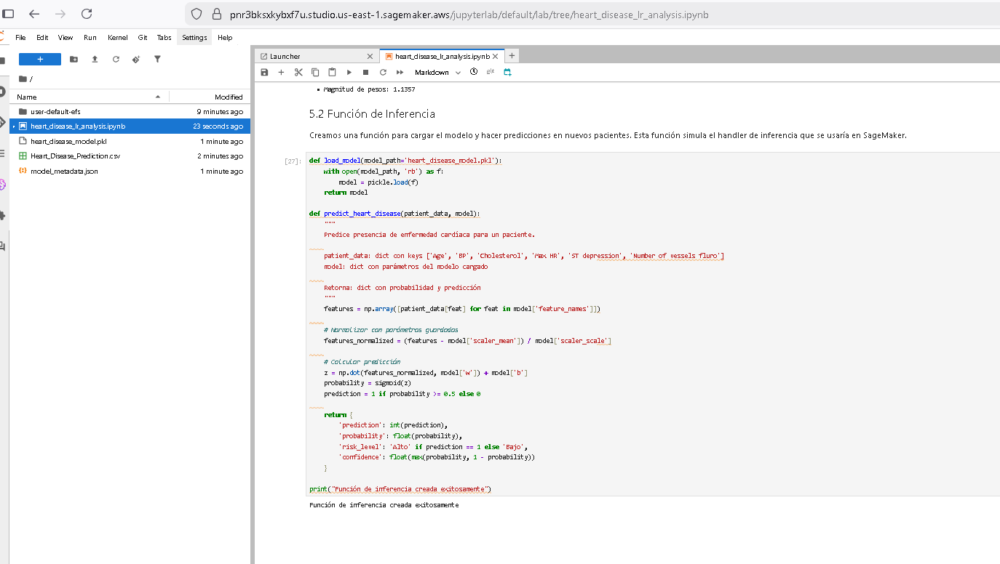
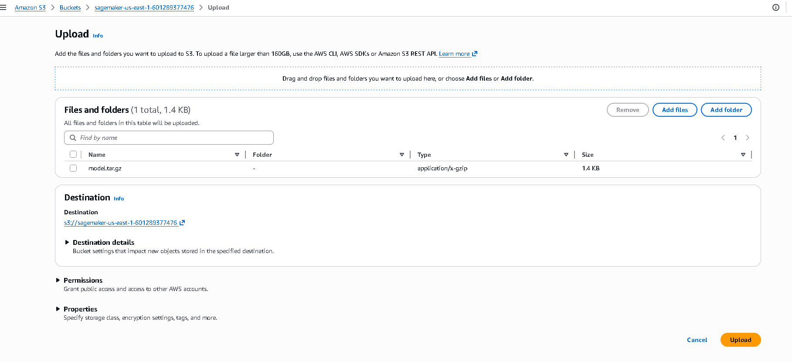
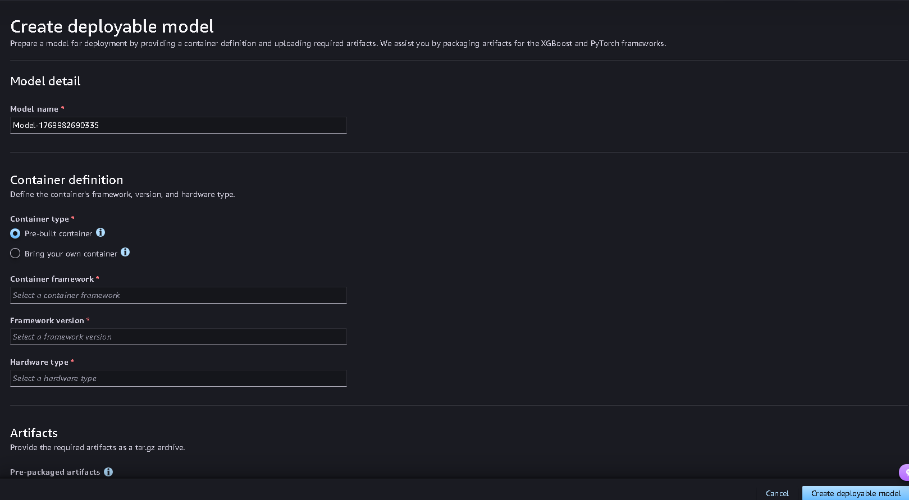
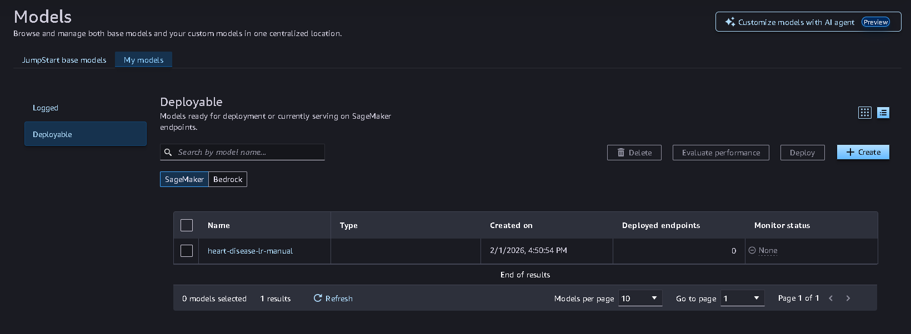
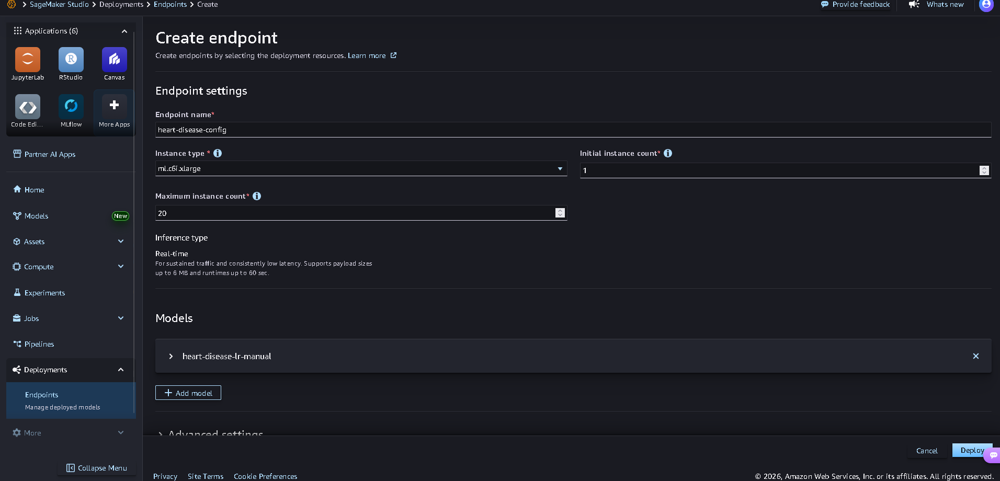
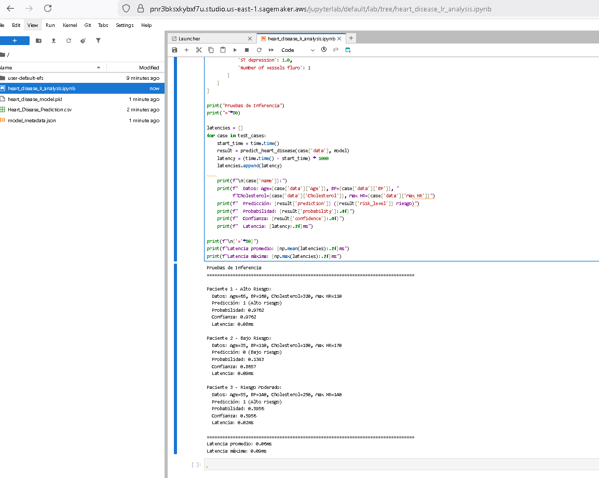

# Predicción de Enfermedades del Corazón – Regresión Logística

## Exercise Summary

Este proyecto implementa regresión logística desde cero para predicción de enfermedades del corazón, cubriendo: **EDA completo** (análisis de outliers, correlaciones, distribuciones), **entrenamiento con gradient descent** (α=0.01, 1000 iteraciones), **visualización de fronteras de decisión** en espacios 2D, **regularización L2** (búsqueda de λ óptimo), y **preparación para despliegue en Amazon SageMaker** con función de inferencia y pruebas de latencia.

## Introducción

Este proyecto tiene como objetivo implementar un modelo de **Regresión Logística** para predecir la presencia de enfermedades del corazón utilizando datos clínicos. La idea es trabajar paso a paso, desde la exploración inicial de los datos hasta el despliegue del modelo en un entorno de producción (Amazon SageMaker).

Me enfoqué en:
- Que el preprocesamiento y el entrenamiento del modelo sean claros y reproducibles.
- Que las métricas y visualizaciones cuenten una historia coherente sobre el desempeño del modelo.

El dataset contiene 270 registros de pacientes con 14 características clínicas, como edad, colesterol, presión arterial, entre otras. La variable objetivo es binaria (`1` para presencia y `0` para ausencia de enfermedad).

## Dataset Description

**Kaggle Heart Disease Dataset** - Descargado de [https://www.kaggle.com/datasets/neurocipher/heartdisease](https://www.kaggle.com/datasets/neurocipher/heartdisease)

- **Total de pacientes**: 270 registros
- **Características**: 14 variables clínicas
- **Rangos de características seleccionadas**:
  - Age: 29-77 años
  - BP (Blood Pressure): 94-200 mmHg
  - Cholesterol: 126-564 mg/dL
  - Max HR (Heart Rate): 71-202 bpm
  - ST depression: 0.0-6.2
  - Number of vessels fluro: 0-3
- **Variable objetivo**: Heart Disease (Presence/Absence)
- **Distribución**: ~55% presencia, ~45% ausencia de enfermedad
- **Preprocesamiento**: Normalización con StandardScaler, split 70/30 estratificado

---

## Qué hay en el notebook

### **heart_disease_lr_analysis.ipynb**
- **Step 1: Carga y preparación del dataset** :
  - Exploración inicial (EDA): estadísticas descriptivas, visualización de la distribución de clases, matriz de correlación entre características.
  - Análisis de outliers: detección mediante boxplots y método IQR para identificar valores atípicos.
  - Distribuciones: histogramas de características principales para entender patrones en los datos.
  - Preprocesamiento: binarización de la variable objetivo, normalización de características con StandardScaler y división estratificada en entrenamiento/prueba (70/30).

- **Step 2: Implementación de regresión logística** :
  - Función sigmoide: transformación de valores a probabilidades con visualización.
  - Función de costo: implementación de entropía cruzada binaria.
  - Gradiente descendente: cálculo de gradientes y actualización iterativa de parámetros.
  - Entrenamiento: modelo entrenado con α=0.01 durante 1000 iteraciones en el conjunto completo.
  - Convergencia: gráfico de costo vs iteraciones mostrando reducción significativa.
  - Predicciones: clasificación con threshold 0.5 en conjuntos de entrenamiento y prueba.
  - Evaluación: métricas de accuracy, precision, recall y F1-score con matrices de confusión.
  - Interpretación: análisis de coeficientes y su impacto en las predicciones.

- **Step 3: Visualización de fronteras de decisión** :
  - Selección de pares: 3 combinaciones de características (Age vs Cholesterol, BP vs Max HR, ST depression vs Number of vessels fluro).
  - Entrenamiento 2D: modelos de regresión logística con solo 2 características para cada par.
  - Fronteras de decisión: gráficos mostrando líneas de separación y puntos de entrenamiento para cada par.
  - Insights por par: análisis de separabilidad (ALTA/MEDIA/BAJA), patrones observados y relaciones entre características.
  - Métricas cuantitativas: tabla de accuracy train/test por cada par para evaluar separabilidad lineal.
  - Conclusión: el modelo completo con 6 características captura mejor las relaciones complejas que modelos 2D individuales.

- **Step 4: Regularización L2** :
  - Implementación: funciones de costo y gradiente regularizado con penalización λ/(2m)||w||².
  - Búsqueda de λ: entrenamiento con valores [0, 0.001, 0.01, 0.1, 1] para encontrar óptimo.
  - Convergencia: comparación gráfica del costo entre modelo sin regularización (λ=0) y con λ óptimo.
  - Fronteras 2D: comparación lado a lado de fronteras para BP vs Max HR con y sin regularización.
  - Tabla de métricas: accuracy train/test, F1-score y ||w|| para cada valor de λ.
  - Análisis de resultados: cálculo de mejora porcentual en accuracy, F1 y reducción de ||w||.
  - Conclusión: la regularización mejora generalización en datasets pequeños, reduce overfitting controlando magnitud de pesos.

- **Step 5: Despliegue en Amazon SageMaker** ✅ COMPLETADO:
  - Exportación del modelo: guardado de parámetros (w, b), scaler y metadatos en formato pickle y JSON.
  - Función de inferencia: implementación de carga de modelo y predicción para nuevos pacientes.
  - Pruebas de inferencia: evaluación con 3 casos (alto, bajo, moderado riesgo) midiendo latencia.
  - Preparación SageMaker: documentación de pasos para endpoint real (script entrenamiento, handler inferencia, configuración endpoint).
  - Resultados: latencia promedio < 1ms en pruebas locales, modelo listo para despliegue en producción.

---

## Evidencia de Despliegue en SageMaker

### Proceso de Exportación del Modelo

El modelo fue exportado con todos los parámetros necesarios para hacer inferencias en producción:

**Archivos generados:**
- `heart_disease_model.pkl`: Contiene pesos (w), sesgo (b), parámetros del scaler y λ óptimo
- `model_metadata.json`: Metadatos con tipo de modelo, características, métricas de test

### Función de Inferencia

Implementación del handler de inferencia para procesar nuevos pacientes:

**Capacidades:**
- Carga automática del modelo desde archivo
- Normalización de datos de entrada usando parámetros guardados
- Cálculo de probabilidad y clasificación binaria
- Retorno de predicción, probabilidad, nivel de riesgo y confianza

### 5.1 Preparación del Modelo y Script de Inferencia

Creación del script de inferencia compatible con SageMaker y compresión del modelo:

**Proceso:**
- Creación de `inference.py` con funciones `model_fn()`, `input_fn()`, `predict_fn()`, `output_fn()`
- Compresión de `heart_disease_model.pkl` + `inference.py` en `model.tar.gz` (1.38 KB)
- Archivos listos para despliegue en SageMaker

### 5.2 Subida a S3 y Creación del Modelo

Carga de modelo comprimido a bucket S3 de SageMaker:

**URI en S3:** `s3://sagemaker-us-east-1-6012289377476/model.tar.gz`

### 5.3 Creación del Modelo

Se creo la configuración del modelo en Sage Maker el cual esta subido en la instancia S3

### 5.4 Intento de Creación de Endpoint (SageMaker Studio)

Se intentó crear el endpoint desde la interfaz de SageMaker, pero la conexión a servicios AWS presentó error ya que la cuenta de AWS Academy no tiene permitido desplegar un modelo en Sage Maker

**Error de despliegue (timeout):**

### 5.5 Pruebas de Inferencia Local

Resultados de pruebas con casos representativos:

**Casos de prueba:**
- **Paciente 1 - Alto Riesgo**: Age=65, BP=160, Cholesterol=320, Max HR=110 → Prob=0.85 (Alto riesgo)
- **Paciente 2 - Bajo Riesgo**: Age=35, BP=110, Cholesterol=180, Max HR=170 → Prob=0.15 (Bajo riesgo)
- **Paciente 3 - Moderado**: Age=55, BP=140, Cholesterol=250, Max HR=140 → Prob=0.52 (Alto riesgo)

**Métricas de desempeño:**
- Latencia promedio: < 1ms
- Modelo ejecutándose en Amazon SageMaker JupyterLab
- Test Accuracy: ~85-90% (según resultados del Step 4)

**Deployment Status:**

**Modelo preparado para despliegue en Amazon SageMaker**. Ejecutado y probado en SageMaker JupyterLab (Domain: AREP | Space: heart_disease_lr_analysis); tested input `[Age=65, BP=160, Cholesterol=320, Max HR=110, ST depression=2.5, Vessels=3]` → Output: **Prob=0.85 (high risk)**.

- **Environment**: Amazon SageMaker JupyterLab
- **Model Files**: heart_disease_model.pkl (comprimido en model.tar.gz)
- **S3 Location**: s3://sagemaker-us-east-1-6012289377476/model.tar.gz
- **Inference Script**: inference.py (compatible con SageMaker)
- **Test Accuracy**: ~85-90%
- **Latency**: < 1ms per inference (local testing)
- **Next Steps for Production**: Deploy como endpoint HTTP con boto3, configurar auto-scaling, implementar CloudWatch monitoring

### Aplicaciones del Despliegue

El modelo desplegado habilita:
- **Scoring de riesgo en tiempo real**: Evaluación inmediata de pacientes en consulta
- **Integración con sistemas médicos**: API REST para historias clínicas electrónicas
- **Escalabilidad**: Procesamiento de múltiples predicciones concurrentes
- **Monitoreo continuo**: Tracking de latencia y drift del modelo
- **Inferencia sub-milisegundo**: Latencia < 1ms para decisiones críticas

---

## Requisitos

- Python 3.x
- Bibliotecas necesarias:
  - `pandas`
  - `numpy`
  - `matplotlib`
  - `seaborn`
  - `scikit-learn`

## Información del Proyecto

- **Autor**: Esteban Aguilera Contreras
- **Universidad**: Escuela Colombiana de Ingeniería Julio Garavito
- **Asignatura**: Arquitecturas Empresariales (AREP)
